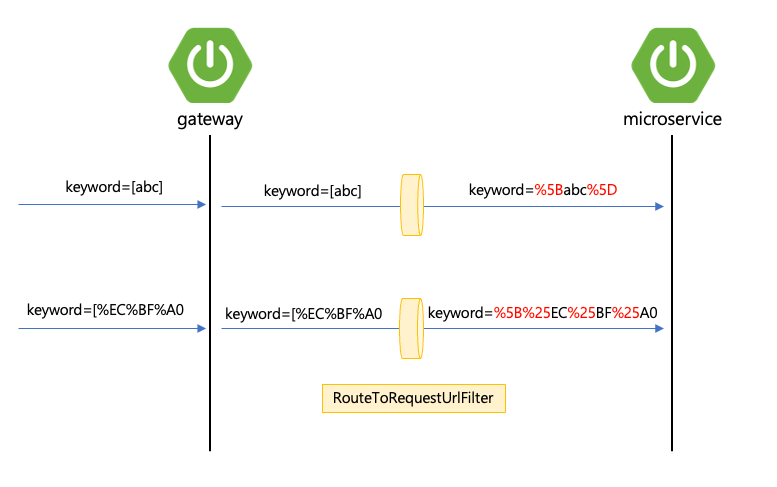

안녕하세요. NHN COMMERCE 개발자입니다.

NHN커머스에서는 최근 [Spring Boot의 EOL이슈](https://endoflife.date/spring-boot)
와 OpenTelemetry 호환성 이슈로 Spring Cloud Gateway를 업그레이드 과정에서 경험한
이슈들을 공유하고자 합니다.

# Spring Boot 업그레이드

- 2.3.5.RELEASE -> 3.1.3으로 업그레이드
- 첫 업그레이드 작업 후 여러가지 인코딩 이슈 발생

## 한글 + 대괄호 인코딩 이슈

쇼핑몰 쿠폰 검색시 한글 + 대괄호 키워드 검색을 하면 검색 불가 현상 발생


퍼센트 인코딩된 문자열 + 대괄호가 있는 경우에 게이트웨이에서 마이크로서비스로
포워딩하기 전에 %를 한번 더 인코딩한다. 

- 대괄호 + 영어인 경우에는 문제가 없다.
- 대괄호 + 퍼센트 인코딩된 문자열의 경우 %가 한번 더 인코딩`(%25)` 되어
  마이크로서비스로 넘겨진다.

에러가 발생하는 요청 예시:

/xxx.com/coupons?keyword=**[%EC%BF%A0%EC%BF%A0%EC%BF%A0]**%ED%8F%AC%ED%8F%AC%ED%8F%B0

### 원인

Spring Cloud Gateway는 `RouteToRequestUrlFilter`에서 요청 URI이 제대로 인코딩
되어있는지 검증한다. 제대로 인코딩이 되어있지 않는다면 강제로 인코딩하여 URI을
수정한다.

쿼리 파라미터의 경우
[RFC 3986](https://datatracker.ietf.org/doc/html/rfc3986#section-3.4)을
만족시키는 경우에만 인코딩이 되었다고 판단한다.

RFC 3986에서 Query parameter는 다음을 만족시켜야 한다.

- 알파벳, 숫자, `~`, `-`, `.`, `_` 은 그대로 사용
- SPACE(공백)은 `+` 또는 `%20`으로 인코딩 해야 함.
- `+`는 `%2B`로 인코딩 해야 함.
- 그 외 다른 모든 문자들은 %인코딩
  - ASCII 문자열은 `%HH`으로 인코딩
  - ASCII가 아닌 문자열은 UTF-8로 인코딩 (`%HH%HH%HH`)

### **RouteToRequestUrlFilter** 상세 분석

QueryParameter의 경우 `[`, `]` 가 있는 경우 인코딩이 안되어있다고 가정하고
강제로 인코딩한다. 그래서 퍼센트 인코딩과 대괄호가 같이 포함된 쿼리파라미터가
요청에 들어올 경우, **게이트웨이는 인코딩이 안되어있다고 판단하고 강제로
인코딩하여 %를 한번 더 인코딩한다.**

### 그냥 대충 이렇게 하면 되지 않나..

```kotlin
@Component
class UriEncodeGlobalFilter: GlobalFilter, Ordered {

    private fun String.manualEncode(): String {
        return this.replace("[", "%5B")
            .replace("]", "%5D")
    }

    override fun filter(exchange: ServerWebExchange, chain: GatewayFilterChain): Mono<Void> {
        return with(exchange.request) {
            when (method) {
                HttpMethod.GET -> encode(exchange, chain)
                else -> chain.filter(exchange)
            }
        }
    }

    private fun encode(exchange: ServerWebExchange, chain: GatewayFilterChain): Mono<Void> {
        val newQueryParams = LinkedMultiValueMap<String, String>()

        exchange.request.queryParams.forEach { (key, values) ->
            val newValues = values.map { it.manualEncode() }
            newQueryParams[key] = newValues
        }

        val newUri = UriComponentsBuilder.fromHttpRequest(exchange.request)
            .replaceQueryParams(newQueryParams)
            .build()
            .toUri()

        return chain.filter(
            exchange.mutate().request(
                exchange.request.mutate().uri(newUri)
                    .build()
            ).build()
        )
    }

    override fun getOrder(): Int {
        return Int.MIN_VALUE
    }
}
```

- 사실 `exchange.request.queryParams`은 요청받은 쿼리파라미터를 디코딩한 값으로
  변환된 값임.
- `manualEncode()` 메서드 해봤자 value는 이미 디코딩된 값이기 때문에 소용없다.

### 해결 방법

GlobalFilter를 하나 만들어서 쿼리파라미터를 디코딩한 것을 다시 인코딩해서 URI를
새로 만들었다.

```kotlin
@Component
class UriEncodeGlobalFilter: GlobalFilter, Ordered {

    /**
     * UriComponentsBuilder.fromUri에서 빌드하면 자동 인코딩이 된다.
     * the components in the resulting builder will be in fully encoded (raw) form and further changes must also supply values that are fully encoded
     */

    private fun encode(exchange: ServerWebExchange, chain: GatewayFilterChain): Mono<Void> {
        val newRequest = exchange.request.mutate().uri(
            UriComponentsBuilder.fromHttpRequest(exchange.request)
                .replaceQueryParams(exchange.request.queryParams)
                .encode()
                .build()
                .toUri()
        ).build()

        return chain.filter(
            exchange.mutate().request(
                newRequest
            ).build()
        )
    }

    override fun filter(exchange: ServerWebExchange, chain: GatewayFilterChain): Mono<Void> {
        return with(exchange.request) {
            when (method) {
                HttpMethod.GET -> encode(exchange, chain)
                else -> chain.filter(exchange)
            }
        }
    }

    override fun getOrder(): Int {
        return Int.MIN_VALUE
    }
}
```

## 사이드이펙트 1: 퍼센트 인코딩된 Path 더블 인코딩 이슈

UriEncodeGlobalFilter 적용 후 발생하는 원인으로 퍼센트 인코딩된 Path가 들어오는
경우 게이트웨이에서 path를 더블인코딩하여 마이크로서비스에게 전달된다.

### 원인

디코딩된 쿼리파라미터를 replace 후 encode()로 URI을 전체 인코딩하는데, 퍼센트
인코딩된 Path가 한번 더 인코딩되어 퍼센트가 더블인코딩된다.

```kotlin
val newRequest = exchange.request.mutate().uri(
    UriComponentsBuilder.fromHttpRequest(exchange.request)
        .replaceQueryParams(exchange.request.queryParams)
        .encode() // 이부분이 문제
        .build()
        .toUri()
).build()
```

### 해결

path 또한 디코딩된 것으로 replace를 한다.

```kotlin
val newRequest = exchange.request.mutate().uri(
    UriComponentsBuilder.fromHttpRequest(exchange.request)
        .replaceQueryParams(exchange.request.queryParams)
        .replacePath(exchange.request.uri.path)
        .encode() // 이부분이 문제
        .build()
        .toUri()
).build()
```

## 사이드이펙트 2: 인코딩된 중괄호

중괄호로 감싸져있는 문자열은 인코딩이 안된다.

### 원인

- 실제로 쿼리파라미터를 인코딩하는 로직이다. 해석하면 중괄호로 감싸진 문자열은
  인코딩 안하겠다는 뜻임.

### 해결방법

중괄호를 인코딩한 문자열을 디코딩 후 인코딩할 때 예외가 발생하는 것이기 때문에
디코딩 -> 인코딩하는 과정이 있으면 안된다. 3번 해결방식과 같으므로 일단 패스

## 사이드이펙트 3: + 문자

`+` 문자열을 인코딩한 상태(`%2B`)로 요청을 했는데 게이트웨이에서
마이크로서비스로 전달할 때는 `+` 문자열로 전달되어 실제 마이크로서비스에서는
`+`를 디코딩하여 공백(``)으로 받음.

### 원인

개발한 필터에서 쿼리파라미터를 디코딩한 것을 `UriComponentsBuilder`가 다시
인코딩해서 보내주기 때문. `+` 문자의 특수성 때문에 그렇다.

### UriComponentsBuilder가 인코딩 하는 방식

- `isPchar() == false`인 문자열만 따로 인코딩한다.

- 퍼센트 인코딩된 문자열을 제외한 나머지 중에서 `+`만 디코딩 하는 경우
  **공백**으로 변경된다.

### 해결 방법

`+` 문자열 때문에 파라미터를 임의로 디코딩 후 다시 인코딩해서 보내주면 문제가
발생한다. 그래서 필터 로직 자체를 변경해야 함.

해결 방법은 rawQuery를 가져와서 이전에 문제가 되었던 대괄호(`[`, `]`)를 수동으로
인코딩해서 쿼리파라미터를 변경하는 것으로 함.

- 번외로 중괄호도 있어서 중괄호도 추가.

```kotlin
private fun encode(exchange: ServerWebExchange, chain: GatewayFilterChain): Mono<Void> {

    val newQuery = exchange.request.uri.rawQuery?.takeIf { it.isNotBlank() }
        ?.replace("[", "%5B")
        ?.replace("]", "%5D")
        ?.replace("{", "%7B")
        ?.replace("}", "%7D")
        .orEmpty()

    val newRequest = exchange.request.mutate().uri(
        UriComponentsBuilder.fromHttpRequest(exchange.request)
            .replaceQuery(newQuery)
            .build(true)
            .toUri()
    ).build()

    return chain.filter(
        exchange.mutate().request(
            newRequest
        ).build()
    )
}
```

- `exchange.request.uri.query` 또는 `exchange.request.queryParams`은 디코딩된
  값을 읽을 때 사용하는 것
- `exchange.request.rawQuery`가 실제로 들어온 쿼리다.
- 대괄호는 기본적으로 인코딩된 채로 들어와야 하는데, 우리는 인코딩 안된 대괄호를
  받아들였기 때문에 문제가 발생.
- 필터에서 rawQuery값을 받아와서 `[`는 `%5B`, `]`는 `%5D`로 변환하여 수동으로
  대괄호를 인코딩해서 넘겨준다.
- 그리고 build(true)로 하면 이 값은 인코딩된 값으로 간주하는데 이렇게 주면
  `RouteToRequestUrlFilter`에서 따로 인코딩 검증 및 변환 과정을 생략한다.

## 대괄호 이슈 친구 : = 문자

에러로그를 확인해보니 인코딩 안된 `=` 문자도 에러가 발생한다. 쿼리에서 `=`
문자는 특수한 역할을 하는데, 바로 key와 value를 나누는 기준을 맡는 문자이다.
그래서 value에 `=` 문자를 넣고 싶다면 인코딩을 해야 한다.

하지만 요청에 `=`을 인코딩하지 않고 value에 넣어서 문제가 발생하는 경우도
확인되었다.

### 원인

=를 인코딩하지 않고 보내는게 일단 잘못.

### 해결방법

=은 보통의 replace로는 수동 인코딩이 불가능, rawQuery를 앰퍼센트 기준으로 나누면
일련의 key-value 쌍으로 분리, 각 key-value 쌍에 대해 `=`을 기준으로 key, value를
나눈 다음 key, value 각각에 대해 수동 인코딩

```kotlin
private fun String.manualEncode(): String {
    return this.replace("[", "%5B")
        .replace("]", "%5D")
        .replace("=", "%3D")
}
```

```kotlin
val newQuery = StringBuilder()

exchange.request.uri.rawQuery?.takeIf { it.isNotBlank() }?.split("&")?.forEach { keyAndValue ->
    val firstIndex = keyAndValue.indexOfFirst { it == '=' }

    val key = keyAndValue.substring(0, firstIndex).manualEncode()
    val value = keyAndValue.substring(firstIndex + 1, keyAndValue.length).manualEncode()

    newQuery.append(key)
        .append("=")
        .append(value)
        .append("&")
}
```

### 쿼리파라미터 빈값 처리

쿼리파라미터 중에 Key값만 전달하는 경우도 있어서 value가 없는 경우가 있다. 이
경우에는 StringIndexOutOfBoundException이 발생.

### 해결 방법

빈값 예외처리를 한다.

```kotlin
@Component
class UriEncodeGlobalFilter: GlobalFilter, Ordered {

    private fun String.manualEncode(): String {
        return this.replace("[", "%5B")
            .replace("]", "%5D")
            .replace("=", "%3D")
    }

    private fun encode(exchange: ServerWebExchange, chain: GatewayFilterChain): Mono<Void> {

        val newQuery = StringBuilder()

        exchange.request.uri.rawQuery?.takeIf { it.isNotBlank() }?.split("&")?.forEach { keyAndValue ->
            val firstIndex = keyAndValue.indexOfFirst { it == '=' }

            if (firstIndex == -1) {
                newQuery.append(keyAndValue)
                    .append("&")
            } else {
                val key = keyAndValue.substring(0, firstIndex).manualEncode()
                val value = keyAndValue.substring(firstIndex + 1, keyAndValue.length).manualEncode()

                newQuery.append(key)
                    .append("=")
                    .append(value)
                    .append("&")
            }
        }

        newQuery.lastIndex.takeIf { it > 0 }?.also {
            newQuery.deleteCharAt(it)
        }

        val newRequest = exchange.request.mutate().uri(
            UriComponentsBuilder.fromHttpRequest(exchange.request)
                .replaceQuery(newQuery.toString())
                .build(true)
                .toUri()
        ).build()

        return chain.filter(
            exchange.mutate().request(
                newRequest
            ).build()
        )
    }


    override fun filter(exchange: ServerWebExchange, chain: GatewayFilterChain): Mono<Void> {
        return with(exchange.request) {
            when (method) {
                HttpMethod.GET -> encode(exchange, chain)
                else -> chain.filter(exchange)
            }
        }
    }

    override fun getOrder(): Int {
        return Int.MIN_VALUE
    }
}
```

## 결론

- url encoding 스펙에 대해서 미리 미리 공부해야한다.
- 이미 엎질러진 물을 어떻게 주워담을지 고민이 필요.
